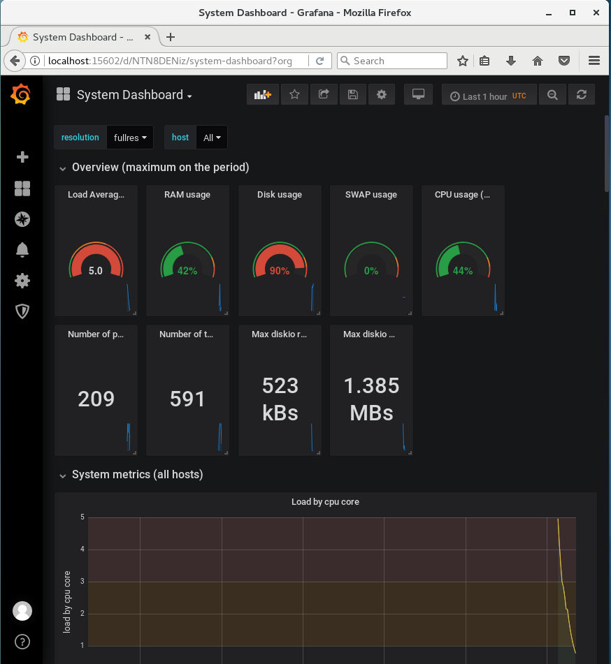
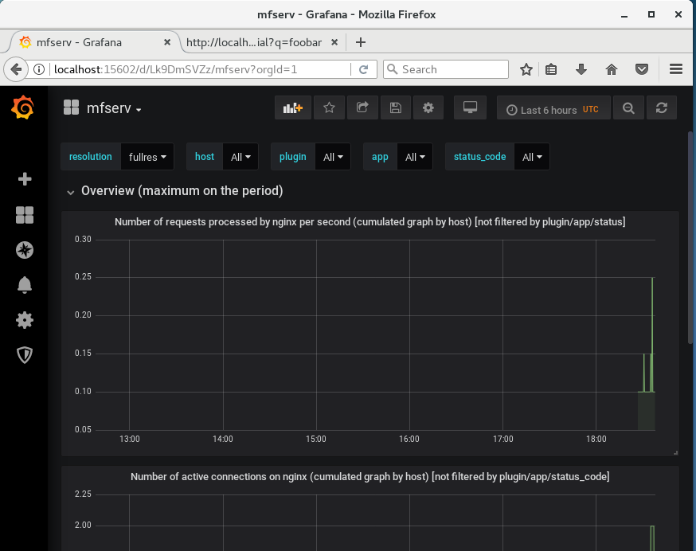
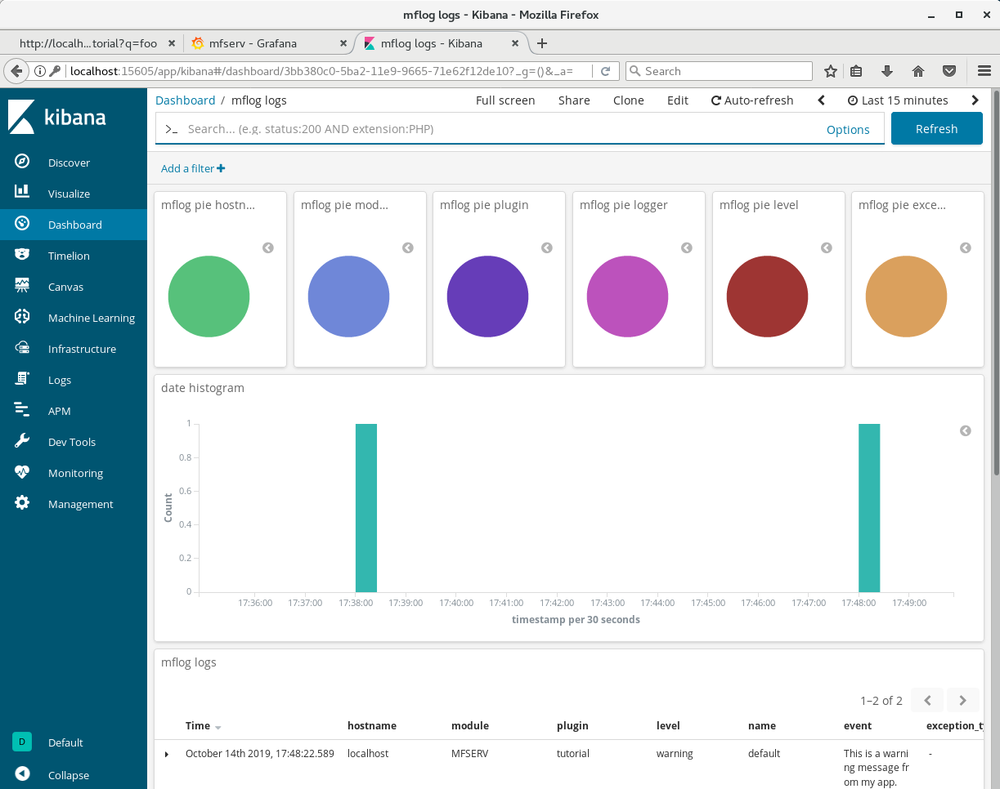

[< Previous step: Put some code in your API](./3_second_api.md)

## Monitor your application

The MetWork Framework monitoring module is called mfadmin. It also contains the mfsysmon submodule which provides a system monitoring out of the box.

Let's install it. Login as root user, and install mfadmin and mfsysmon:

``` bash
# As root user
yum -y install metwork-mfadmin metwork-mfsysmon
```

Start the services:

``` bash
service metwork start
```

### System monitoring

Open `http://localhost:15602`in your browser, you will see the monitoring website, built upon Grafana open source project. Login with the following credentials:
* user: admin
* password: admin

For your first login, it will ask you to change your password. Just click on 'skip' for now.

This monitoring website will give you access to several dashboards. You can already clic on 'System Dashboard', which will give you something like this:



### Web API monitoring

MetWork Framework provides a web monitoring feature out of the box. Indeed, mfserv deploys an nginx server in front of all the APIs, and the monitoring service can use these logs.

Let's enable web API monitoring.

To enable web API monitoring, we have to tell the mfserv module where to send the logs. In our tutorial, the mfadmin module and the mfserv module are installed on the same machine, thus we are going to send the logs to localhost:

``` bash
# Switch to mfserv user
su - mfserv
```

And then edit the file `~/config/config.ini`. In the `[admin]` section, add `hostname=localhost`, `send_nginx_logs=1` and `send_mflog_logs=1`. It should look like that:

``` ini
...
[admin]

# Hostname hosting the mfadmin module (if any)
# null => no monitoring
hostname=localhost
...
# If send_nginx_logs=1, send nginx access logs to the configured admin hostname
send_nginx_logs=1

# If send_mflog_logs=1, send mflog logs to the configured admin hostname
send_mflog_logs=1
...
```

After this configuration change, you have to restart mfserv service:

``` bash
# As root user
su -
service metwork restart mfserv
```

Now, you can make some hits on your API by calling several times `http://localhost:18868/tutorial?q=foobar`. These hits will be logged.

Go back to the Grafana dashboard on `http://localhost:15602`, click on dashboards, select the mfserv dashboard, and you should see some web activity on the charts:



But Grafana only shows metrics. If you want to analyze your logs more precisely, MetWork Framework also ships with a Kibana dashboard. Head to `http://localhost:15605` and login with the following credentials:
* user: admin
* password: admin

Select 'Dashboard / nginx logs', and you should see a wonderful Kibana dashboard in which you can explore your logs in details:


### Application monitoring

There is still one last thing that we may want to do with logs: send logs from the code of our applications and monitor them.

With MetWork Framework, this is really easy. It takes only one line of code!

As mfserv user, in `~/tutorial/tutorial/server.js`, add a line:

``` js
      ...
      res.send('Hello World tutorial! You have entered: ' + entry)
      // Add the following line
      metwork_tools.console_warn('This is a warning message from my app.')
      ...
```

Make some requests on `http://localhost:18868/tutorial?q=foobar`.

Now open your Kibana dashboard on `http://localhost:15605` and click on Dashboard / mflog logs. You should see the logs generated by your app:



On the bottom of the page, you have the detail of every log. It's cool, isn't it?

[Next step: Create a database >](./5_database.md)