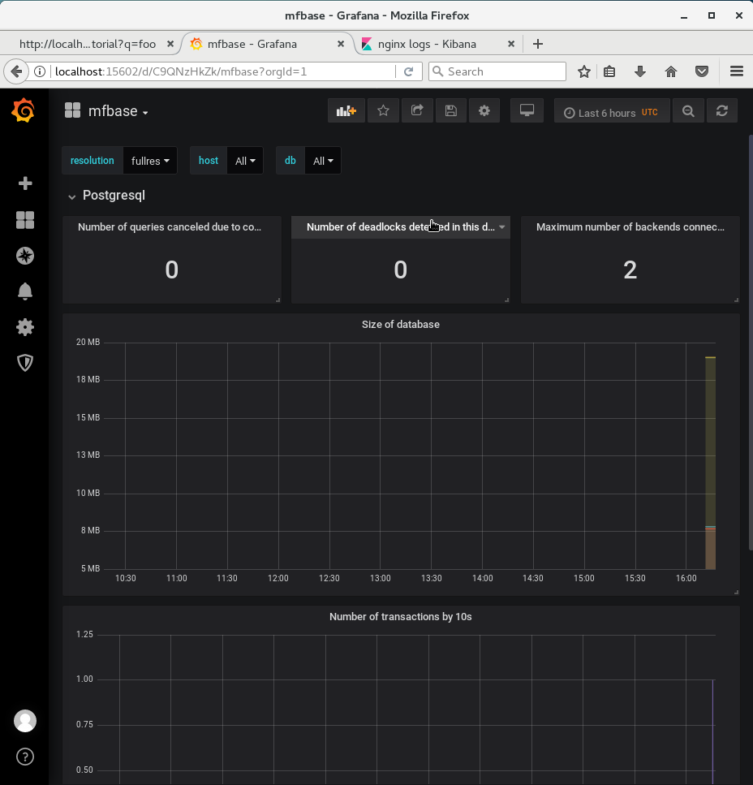

[< Monitor your application](./4_monitoring.md)

## Create a database

### Installation of mfbase

If you need a database for your application, and if you don't have a friend who is expert in database administration, you have two choices:

1. Use sqlite. But it has many limitations.
2. Spend hours understanding how to install and configure a database.

With MetWork Framework, you now have a third option: use the mfbase module.

Let's install it. Login as root user, and install mfbase:

``` bash
# As root user
yum -y install metwork-mfbase
```

Start the services:

``` bash
service metwork start
```

### Create and run the database

The mfbase module supports different types of databases, such as postresql and webdav.

Let's create a postgresql database.

As for other MetWork Framework modules, in mfbase you begin by creating a plugin:

``` bash
# As mfbase user
su - mfbase
bootstap_plugin.py create foo
```

Press enter several times to accept default values.

Edit `~/foo/sql/foo.sql` and put:
``` sql
-- SQL queries to run during plugin installation
CREATE TABLE records(
    name VARCHAR (355)
)
```

The SQL queries in this file will be executed at the creation of the database. It is not mandatory to use this file, you can also create your tables later.

Then release the plugin:

``` bash
# As mfbase user
cd ~/foo
make release
```

The `make release` command should output something like 'plugin is ready at /home/mfbase/foo/foo-0.0.1-1.metwork.mfbase.plugin'. Copy the filename (without the path) and use the following command to install and run your mfbase plugin:

``` bash
plugins.install [YOUR_PLUGIN_FILENAME_HERE]
# For instance plugins.install foo-0.0.1-1.metwork.mfbase.plugin
```

That's all. Your database should be running.

### Check your database

Connect to your database:

``` bash
psql -U plugin_foo -h localhost -p 7432 plugin_foo
```

When prompted, use the password `plugin_foo`.

In the psql prompt, check that your table 'records' has been created:

``` shell
plugin_foo=> \d records
```

You should see an output confirming that your table exists.

Note that if you use the command `\d` to list all tables, you will see several other tables. These tables have been created by the postgis extension. With postgis, you can easily store geographic objects in your database, if you need to do so.

To quit the psql prompt, enter `\q`.

### Put data in our database

Let's add some code in the API we have built previously, to populate the database.

Login as mfserv:

``` bash
su - mfserv
```

Edit the code of our tutorial api, in the file `~/tutorial/tutorial/server.js`. At the beginning of the file, add this code to connect to the database:

``` javascript
const { Pool, Client } = require('pg')

const client = new Client({
    user: 'plugin_foo',
    host: 'localhost',
    database: 'plugin_foo',
    password: 'plugin_foo',
    port: 7432,
})
client.connect()
```

And add a line to write something in the database, just after `res.send...`:

``` javascript
    ...
    res.send('Hello World tutorial! You have entered: ' + entry)
    client.query('INSERT INTO records VALUES (\'' + entry +'\');')
    ...
```

Of course, this is quick and dirty code! This is just for the demo. I'm sure you will write better code in your apps!

Before running this code, we have to install the 'pg' (postgresql) library for nodejs. This is very easy:

``` bash
# As mfserv user
cd ~/tutorial
# In the current version of MetWork, npm is not loaded by default. This will be fixed in next version. Thus load the MetWork package containing npm.
layer_load nodejs@mfext
# Install pg library
npm install pg
# Restart the plugin
make develop
```

Now you can open again your browser on your API url `http://localhost:18868/tutorial?q=foobar`. I let you check that each request makes an insert into the database:

``` bash
# As mfbase user
su - mfbase
psql -U plugin_foo -h localhost -p 7432 plugin_foo
SELECT * FROM records;
\q
```

### Monitor your database

The process to configure monitoring for mfbase is very similar to mfserv. You have to tell mfbase to send its logs to mfadmin installed on localhost.

Switch to mfadmin user:

``` bash
# Switch to mfadmin user
su - mfadmin
```

And then edit the file `~/config/config.ini`. In the `[admin]` section, add `hostname=localhost`. It should look like that:

``` ini
...
[admin]

# Hostname hosting the mfadmin module (if any)
# null => no monitoring
hostname=localhost
...
```

Finally, restart mfadmin service:

``` bash
# As root user
su -
service metwork restart mfbase
```

Make some requests on your API url `http://localhost:18868/tutorial?q=foobar`, and open your Grafana dashboard: `http://localhost:15602`. Head to 'Dashboards / mfbase', and you should see a dashboard with some metrics about your database:



[Next step: Tasks triggered by files >](./6_mfdata.md)